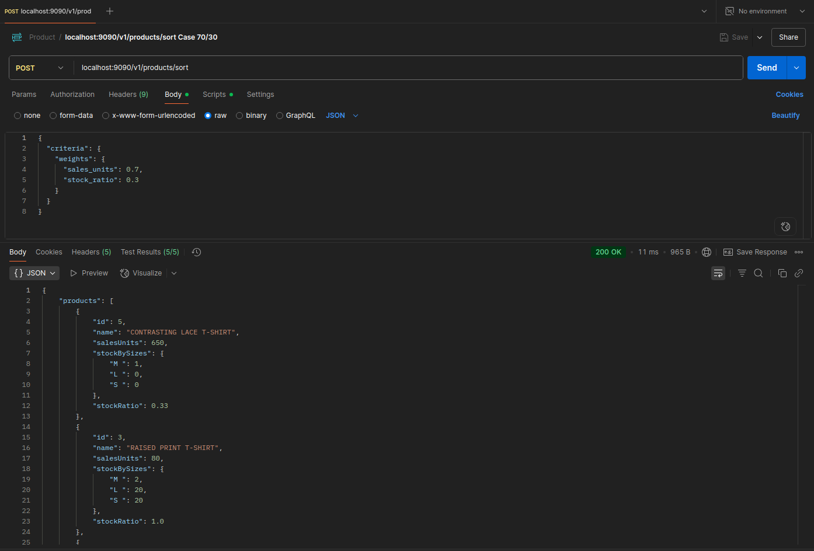
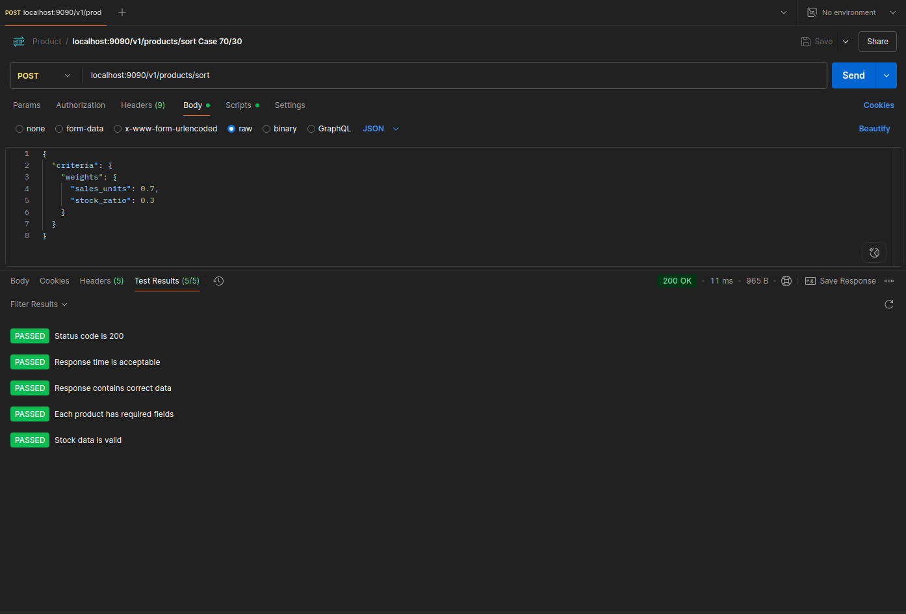

# Product Manager - Microservicio de Ordenación de Productos

[](https://sonarcloud.io/summary/overall?id=NAO0325_product-manager&branch=main)
[](https://www.oracle.com/java/)
[](https://spring.io/projects/spring-boot)
[](https://maven.apache.org/)
[](http://www.h2database.com/)

## 📋 Descripción

Product Manager es un microservicio desarrollado con Spring Boot que implementa **Clean Architecture** y **Arquitectura Hexagonal** para la ordenación inteligente de productos. Permite ordenar un listado de productos basándose en criterios ponderados como unidades de venta y ratio de stock, aplicando algoritmos de suma ponderada para optimizar la presentación de productos.

### ✨ Características Principales

- 🏗️ **Arquitectura Hexagonal** (Ports & Adapters)
- 🧹 **Clean Code** y principios SOLID
- 🗃️ **Base de datos H2** en memoria
- 📊 **Documentación OpenAPI/Swagger** 3.0
- 🧪 **Cobertura de tests** con JaCoCo
- 🔍 **Análisis de calidad** con SonarCloud
- 🔄 **MapStruct** para mapeo automático
- ⚡ **CI/CD** con GitHub Actions

### 🎯 Funcionalidad Principal

El sistema ordena productos de una categoría según criterios ponderados, considerando:
- **Criterio de ventas por unidades**: Puntuación basada en número de unidades vendidas
- **Criterio de ratio de stock**: Puntuación según tallas disponibles (tallas con stock / total tallas)
- **Algoritmo extensible**: Permite añadir nuevos criterios fácilmente
- **Suma ponderada**: Cada criterio tiene un peso asociado para calcular la puntuación final

## 🚀 Inicio Rápido

### Prerrequisitos

Asegúrate de tener instalado:

- ☕ **Java 17** o superior
- 📦 **Maven 3.6+**
- 🐙 **Git**

### Instalación

1. **Clonar el repositorio:**
```bash
git clone https://github.com/NAO0325/product-manager.git
cd product-manager
```

2. **Generar recursos de Swagger:**
```bash
mvn generate-sources
```

3. **Compilar el proyecto:**
```bash
mvn clean install
```

4. **Ejecutar la aplicación:**
```bash
java -jar boot/target/product-manager-boot-1.0.0.jar
```

La aplicación estará disponible en: **`http://localhost:9090`**

### Configuración

#### Variables de Entorno (Opcional)

```bash
# Puerto del servidor (por defecto: 9090)
SERVER_PORT=9090

# Configuración de logging
LOGGING_LEVEL_ROOT=INFO
LOGGING_LEVEL_ORG_SPRINGFRAMEWORK_WEB=DEBUG
```

#### Base de Datos H2

El proyecto utiliza H2 Database en memoria con persistencia en archivo. La consola H2 está disponible en:
- **URL:** `http://localhost:9090/h2-console`
- **JDBC URL:** `jdbc:h2:~/productdb;DB_CLOSE_ON_EXIT=FALSE`
- **Usuario:** `sa`
- **Contraseña:** *(vacía)*

## 🏛️ Arquitectura

### Descripción de la Arquitectura Hexagonal

La aplicación implementa una arquitectura hexagonal (Ports & Adapters) donde el dominio es el núcleo y no se acopla a elementos externos, siguiendo principios de **Domain Driven Design (DDD)**.


### Estructura del Proyecto

```
product-manager/
├── 📁 application/                                    # 🧠 Lógica de negocio y puertos
│   ├── 📁 domain/                                    # Entidades del dominio
│   │   ├── 📄 Product.java                          # Entidad principal Product
│   │   ├── 📁 valueobjects/                         # Value Objects
│   │   │   ├── 📄 SortingCriteria.java              # Criterios de ordenación
│   │   │   └── 📄 WeightedScoringCriterion.java     # Criterio con peso asociado
│   │   └── 📁 services/                             # Servicios de dominio
│   │       ├── 📄 ProductSortingService.java        # Servicio ordenación productos
│   │       ├── 📄 ScoringCriteriaFactory.java       # Factory de criterios ponderados
│   │       └── 📁 scoring/                          # Criterios de puntuación específicos
│   │           ├── 📄 ScoringCriterion.java         # Interface criterio puntuación
│   │           ├── 📄 SalesUnitsScoringCriterion.java # Criterio ventas
│   │           └── 📄 StockRatioScoringCriterion.java # Criterio stock
│   ├── 📁 ports/                                    # Interfaces (driving/driven)
│   │   ├── 📁 driving/                              # Puertos de entrada
│   │   │   └── 📄 ProductServicePort.java           # Puerto servicio Product
│   │   └── 📁 driven/                               # Puertos de salida
│   │       └── 📄 ProductRepositoryPort.java        # Puerto repositorio Product
│   └── 📁 services/                                 # Casos de uso
│       └── 📄 ProductServiceUseCase.java            # Caso de uso principal
├── 📁 driving/                                        # 🔵 Adaptadores de entrada
│   └── 📁 api-rest/                                 # Controladores REST
│       ├── 📁 adapters/                             # Implementación de controladores
│       │   └── 📄 ProductControllerAdapter.java     # Controlador REST Product
│       ├── 📁 mappers/                              # Mappers MapStruct
│       │   └── 📄 ProductMapper.java                # Mapper Product DTO
│       ├── 📁 models/                               # DTOs generados por OpenAPI
│       │   ├── 📄 SortProductsRequest.java          # DTO petición ordenación
│       │   ├── 📄 SortProductsResponse.java         # DTO respuesta ordenación
│       │   ├── 📄 Product.java                      # DTO Product
│       │   └── 📄 Error.java                        # DTO errores
│       ├── 📁 error/                                # Manejo de excepciones
│       │   └── 📄 CustomExceptionHandler.java       # Manejador global excepciones
│       ├── 📁 contracts/                            # Especificación OpenAPI
│       │   └── 📄 openapi.yaml                      # Especificación API REST
│       └── 📁 postman/                              # Colección de Postman
│           └── 📄 Product.postman_collection.json   # Tests Postman
├── 📁 driven/                                         # 🔴 Adaptadores de salida
│   └── 📁 repository-sql/                           # Implementación JPA/H2
│       ├── 📁 adapters/                             # Implementación de repositorios
│       │   └── 📄 ProductRepositoryAdapter.java     # Adaptador repositorio JPA
│       ├── 📁 models/                               # Entidades JPA
│       │   ├── 📄 ProductEntity.java                # Entidad JPA Product
│       │   ├── 📄 ProductStockEntity.java           # Entidad JPA Stock
│       │   └── 📄 ProductStockId.java               # ID compuesto Stock
│       ├── 📁 mappers/                              # Mappers de entidad
│       │   └── 📄 ProductEntityMapper.java          # Mapper entidad-dominio
│       ├── 📁 config/                               # Configuración JPA
│       │   └── 📄 RepositoryConfig.java             # Config repositorios JPA
│       └── 📄 ProductJpaRepository.java             # Repository JPA Spring Data
├── 📁 boot/                                           # 🚀 Configuración y arranque
│   ├── 📁 src/main/java/                            # Clase principal
│   │   ├── 📄 Application.java                      # Clase main Spring Boot
│   │   └── 📄 DomainConfig.java                     # Configuración de servicios dominio
│   └── 📁 src/main/resources/                       # Configuración
│       ├── 📄 application.yml                       # Config aplicación
│       └── 📄 init.sql                              # Datos iniciales H2
├── 📁 .github/workflows/                              # ⚙️ CI/CD
│   └── 📄 build.yml                                 # GitHub Actions pipeline
├── 📄 checkstyle.xml                                 # (Futura mejora)
├── 📄 checkstyle-suppressions.xml                   # (Futura mejora)
├── 📄 .gitignore                                     # Archivos ignorados Git
├── 📄 .gitattributes                                # Atributos Git
├── 📄 README.md                                      # Documentación principal
└── 📄 pom.xml                                        # Configuración Maven principal
```

### Componentes Principales


- **🧠 Application**: Define puertos driving/driven y contiene la lógica de negocio pura
- **🔵 Driving Side**: Adaptadores que permiten al exterior interactuar con el dominio (API REST)
- **🔴 Driven Side**: Adaptadores que permiten al dominio interactuar con sistemas externos (Base de datos)
- **🚀 Boot**: Ensambla todos los módulos en un JAR ejecutable con configuración Spring Boot

## 📚 API Documentation

### Documentación Interactiva

- **Swagger UI:** `http://localhost:9090/swagger-ui.html` *(Una vez iniciada la aplicación)*
- **OpenAPI Spec:** [openapi.yaml](driving/api-rest/contracts/openapi.yaml)

### Visualización Externa

[](https://editor.swagger.io/?url=https://raw.githubusercontent.com/NAO0325/product-manager/main/driving/api-rest/contracts/openapi.yaml)
[](https://redocly.github.io/redoc/?url=https://raw.githubusercontent.com/NAO0325/product-manager/main/driving/api-rest/contracts/openapi.yaml)

### Endpoints Disponibles

| Método | Ruta | Descripción |
|--------|------|-------------|
| `POST` | `/v1/products/sort` | Ordena los productos según criterios de ponderación |

#### Ejemplo de Request Body

```json
{
  "criteria": {
    "weights": {
      "sales_units": 0.7,
      "stock_ratio": 0.3
    }
  }
}
```

| Campo | Tipo | Obligatorio | Descripción | Rango |
|-------|------|-------------|-------------|-------|
| `sales_units` | `number` | ✅ | Peso para criterio de ventas | `0.0 - 1.0` |
| `stock_ratio` | `number` | ✅ | Peso para criterio de stock | `0.0 - 1.0` |

## 🧪 Ejemplos de Uso

### Petición de Ejemplo

```bash
curl -X POST "http://localhost:9090/v1/products/sort" \
     -H "Content-Type: application/json" \
     -d '{
       "criteria": {
         "weights": {
           "sales_units": 0.7,
           "stock_ratio": 0.3
         }
       }
     }'
```

### Respuesta Exitosa (200)

```json
{
  "products": [
    {
      "id": 5,
      "name": "CONTRASTING LACE T-SHIRT",
      "salesUnits": 650,
      "stockBySizes": {
        "S": 0,
        "M": 1,
        "L": 0
      },
      "stockRatio": 0.33
    },
    {
      "id": 1,
      "name": "V-NECH BASIC SHIRT",
      "salesUnits": 100,
      "stockBySizes": {
        "S": 4,
        "M": 9,
        "L": 0
      },
      "stockRatio": 0.67
    }
  ],
  "appliedCriteria": {
    "weights": {
      "sales_units": 0.7,
      "stock_ratio": 0.3
    }
  },
  "totalProducts": 6,
  "timestamp": "2024-06-03T14:30:00Z"
}
```

### Casos de Error

#### Criterios inválidos (400)
```json
{
  "code": "INVALID_CRITERIA",
  "message": "Invalid sorting criteria",
  "timestamp": "2024-06-03T14:30:00Z",
  "details": {
    "field": "criteria",
    "issue": "Invalid sorting criteria provided"
  }
}
```

#### Criterios faltantes (400)
```json
{
  "code": "MISSING_CRITERIA",
  "message": "Required sorting criteria is missing or null",
  "timestamp": "2024-06-03T14:30:00Z",
  "details": {
    "field": "criteria",
    "issue": "Criteria cannot be null"
  }
}
```

#### Error de validación (400)
```json
{
  "code": "VALIDATION_ERROR",
  "message": "Invalid request data",
  "timestamp": "2024-06-03T14:30:00Z",
  "details": {
    "fieldErrors": {
      "salesWeight": "must be non-negative",
      "stockRatioWeight": "cannot be null"
    }
  }
}
```

#### JSON inválido (400)
```json
{
  "code": "INVALID_JSON",
  "message": "Invalid JSON format or missing required fields",
  "timestamp": "2024-06-03T14:30:00Z",
  "details": {
    "field": "criteria",
    "hint": "Ensure 'criteria' object is provided with valid 'weights'"
  }
}
```

## 🧪 Testing

### Ejecutar Tests

```bash
# Ejecutar todos los tests
mvn test

# Ejecutar tests con reporte de cobertura
mvn clean test jacoco:report

# Ver reporte de cobertura (abre en navegador)
open target/site/jacoco/index.html
```

### Casos de Prueba Implementados

El proyecto incluye **varios escenarios de prueba** siendo los siguientes los más relevantes:

#### Datos de Test

| ID | Producto | Ventas | Stock S | Stock M | Stock L | Ratio |
|----|----------|--------|---------|---------|---------|-------|
| 1 | V-NECH BASIC SHIRT | 100 | 4 | 9 | 0 | 0.67 |
| 2 | CONTRASTING FABRIC T-SHIRT | 50 | 35 | 9 | 9 | 1.0 |
| 3 | RAISED PRINT T-SHIRT | 80 | 20 | 2 | 20 | 1.0 |
| 4 | PLEATED T-SHIRT | 3 | 25 | 30 | 10 | 1.0 |
| 5 | CONTRASTING LACE T-SHIRT | 650 | 0 | 1 | 0 | 0.33 |
| 6 | SLOGAN T-SHIRT | 20 | 9 | 2 | 5 | 1.0 |

#### Escenarios de Test

1. **Test 70% Ventas / 30% Stock**: Enfoque en rendimiento de ventas
2. **Test 50% Ventas / 50% Stock**: Criterios balanceados
3. **Test 100% Ventas / 0% Stock**: Solo por unidades vendidas
4. **Test 0% Ventas / 100% Stock**: Solo por disponibilidad de stock
5. **Test con criterios inválidos**: Validación de errores

### Postman Collection

Importa y ejecuta la colección de Postman para probar todos los endpoints:
- [Product.postman_collection.json](driving/api-rest/postman/Product.postman_collection.json)





## 🔧 Desarrollo

### Tecnologías Utilizadas

| Tecnología | Versión | Propósito |
|------------|---------|-----------|
| **Java** | 17 | Lenguaje principal |
| **Spring Boot** | 3.2.11 | Framework principal |
| **H2 Database** | Runtime | Base de datos en memoria |
| **MapStruct** | 1.4.2.Final | Mapeo de objetos |
| **Lombok** | Latest | Reducción de boilerplate |
| **JaCoCo** | 0.8.10 | Cobertura de código |
| **Mockito** | 4.7.0 | Testing y mocking |
| **OpenAPI Generator** | 7.0.1 | Generación de APIs |

### Comandos Útiles

```bash
# Compilación rápida (skip tests)
mvn clean install -DskipTests

# Análisis de código con SonarCloud
mvn sonar:sonar

# Ejecutar en modo desarrollo
mvn spring-boot:run -pl boot

# Limpiar y recompilar todo
mvn clean compile

# Generar documentación JavaDoc
mvn javadoc:javadoc
```

### Estructura de la Base de Datos

#### Tabla PRODUCT

| Campo | Tipo | Descripción | Constraints |
|-------|------|-------------|-------------|
| `ID` | `INT` | ID único del producto | **PK, AUTO_INCREMENT** |
| `NAME` | `VARCHAR(255)` | Nombre del producto | **NOT NULL** |
| `SALES_UNITS` | `INT` | Unidades vendidas | **NOT NULL, DEFAULT 0** |

#### Tabla PRODUCT_STOCK

| Campo | Tipo | Descripción | Constraints |
|-------|------|-------------|-------------|
| `PRODUCT_ID` | `INT` | ID del producto | **PK, FK → PRODUCT.ID** |
| `SIZE` | `CHAR(2)` | Talla del producto | **PK, NOT NULL** |
| `QUANTITY` | `INT` | Cantidad en stock | **NOT NULL, DEFAULT 0** |

#### Datos de Ejemplo Preinstalados

```sql
-- Productos
INSERT INTO PRODUCT (ID, NAME, SALES_UNITS) VALUES
(1, 'V-NECH BASIC SHIRT', 100),
(2, 'CONTRASTING FABRIC T-SHIRT', 50),
(3, 'RAISED PRINT T-SHIRT', 80),
(4, 'PLEATED T-SHIRT', 3),
(5, 'CONTRASTING LACE T-SHIRT', 650),
(6, 'SLOGAN T-SHIRT', 20);

-- Stock por tallas
INSERT INTO PRODUCT_STOCK (PRODUCT_ID, SIZE, QUANTITY) VALUES
-- V-NECH BASIC SHIRT: S:4 / M:9 / L:0
(1, 'S', 4), (1, 'M', 9), (1, 'L', 0),
-- CONTRASTING FABRIC T-SHIRT: S:35 / M:9 / L:9  
(2, 'S', 35), (2, 'M', 9), (2, 'L', 9),
-- RAISED PRINT T-SHIRT: S:20 / M:2 / L:20
(3, 'S', 20), (3, 'M', 2), (3, 'L', 20),
-- PLEATED T-SHIRT: S:25 / M:30 / L:10
(4, 'S', 25), (4, 'M', 30), (4, 'L', 10),
-- CONTRASTING LACE T-SHIRT: S:0 / M:1 / L:0
(5, 'S', 0), (5, 'M', 1), (5, 'L', 0),
-- SLOGAN T-SHIRT: S:9 / M:2 / L:5
(6, 'S', 9), (6, 'M', 2), (6, 'L', 5);
```

## 🧮 Algoritmo de Ordenación

### Funcionamiento del Algoritmo

El algoritmo implementa una **suma ponderada** que combina criterios normalizados utilizando el **patrón Strategy** y **Factory Pattern** para máxima extensibilidad:

```java
// Arquitectura del algoritmo mejorada
public class ProductSortingService {
    private final ScoringCriteriaFactory criteriaFactory;
    
    // 1. Crear criterios ponderados usando Factory Pattern
    List<WeightedScoringCriterion> weightedCriteria = 
        criteriaFactory.createWeightedCriteria(criteria);
    
    // 2. Calcular puntuación total combinando criterios
    puntuaciónFinal = Σ(criterio.calculateWeightedScore(producto, todosLosProductos))
    
    // 3. Ordenar por puntuación descendente
    return productos.sorted(byScoreDescending)
}

donde:
- ScoringCriterion: Interface para criterios específicos
- WeightedScoringCriterion: Value Object que encapsula criterio + peso
- ScoringCriteriaFactory: Crea criterios basándose en configuración
```

### Arquitectura de Criterios de Puntuación

#### 🏭 Factory Pattern para Criterios
```java
// ScoringCriteriaFactory
Map<String, ScoringCriterion> availableCriteria = Map.of(
    "SALES_UNITS", new SalesUnitsScoringCriterion(),
    "STOCK_RATIO", new StockRatioScoringCriterion()
    // Fácil añadir nuevos: "MARGIN", new MarginScoringCriterion()
);
```

#### 🎯 Strategy Pattern para Cálculos
```java
// Interface común para todos los criterios
public interface ScoringCriterion {
    double calculateScore(Product product, List<Product> allProducts);
    String getCriterionName();
}
```

#### ⚖️ Value Object para Pesos
```java
// Encapsula criterio + peso con validaciones
public class WeightedScoringCriterion {
    private ScoringCriterion criterion;
    private double weight; // 0.0 - 1.0
    
    public double calculateWeightedScore(Product product, List<Product> allProducts) {
        return criterion.calculateScore(product, allProducts) * weight;
    }
}
```

### Criterios de Ordenación

#### 1. Criterio de Ventas por Unidades (`SalesUnitsScoringCriterion`)
- **Cálculo**: Normalización lineal basada en el producto con más ventas
- **Fórmula**: `ventasProducto / ventasMáximas`
- **Rango**: 0.0 (sin ventas) a 1.0 (máximas ventas)
- **Propósito**: Priorizar productos con mayor rendimiento comercial

#### 2. Criterio de Ratio de Stock (`StockRatioScoringCriterion`)
- **Cálculo**: `tallasDisponibles / totalTallas`
- **Rango**: 0.0 (sin stock) a 1.0 (stock completo)
- **Propósito**: Priorizar productos con mejor disponibilidad

#### 3. Extensibilidad (Nuevos Criterios)
- **Diseño modular**: Implementar `ScoringCriterion` interface
- **Registro automático**: Añadir al `ScoringCriteriaFactory`
- **Sin romper compatibilidad**: Los criterios existentes seguirán funcionando

**Ejemplo de nuevo criterio:**
```java
public class MarginScoringCriterion implements ScoringCriterion {
    @Override
    public double calculateScore(Product product, List<Product> allProducts) {
        // Lógica de cálculo de margen
        return normalizedMargin;
    }
    
    @Override
    public String getCriterionName() {
        return "MARGIN";
    }
}
```

### Ejemplos de Cálculo

#### Ejemplo 1: Enfoque en Ventas (70% ventas, 30% stock)

```
CONTRASTING LACE T-SHIRT:
- Ventas: 650 (máximo) → Score ventas: 1.0
- Stock: 1/3 tallas → Score stock: 0.33
- Puntuación final: (1.0 × 0.7) + (0.33 × 0.3) = 0.799

V-NECH BASIC SHIRT:
- Ventas: 100 → Score ventas: 100/650 = 0.154
- Stock: 2/3 tallas → Score stock: 0.67
- Puntuación final: (0.154 × 0.7) + (0.67 × 0.3) = 0.309
```

#### Ejemplo 2: Enfoque en Stock (30% ventas, 70% stock)

```
CONTRASTING FABRIC T-SHIRT:
- Ventas: 50 → Score ventas: 50/650 = 0.077
- Stock: 3/3 tallas → Score stock: 1.0
- Puntuación final: (0.077 × 0.3) + (1.0 × 0.7) = 0.723
```

## 🐛 Troubleshooting

### Problemas Comunes

**🚫 Puerto ocupado:**
```bash
Error: Port 9090 is already in use
# Solución: Cambiar puerto
java -jar boot/target/product-manager-boot-1.0.0.jar --server.port=8080
```

**💾 OutOfMemoryError:**
```bash
# Solución: Aumentar memoria heap
java -Xmx512m -jar boot/target/product-manager-boot-1.0.0.jar
```

**🧪 Tests fallan:**
```bash
# Limpiar y recompilar
mvn clean compile test-compile test
```

**🔧 Error de compilación MapStruct:**
```bash
# Verificar que Lombok esté antes que MapStruct en annotationProcessorPaths
# Ver boot/pom.xml para configuración correcta
```

**🗃️ Error conexión H2:**
```bash
# Verificar que la aplicación esté ejecutándose
# URL: http://localhost:9090/h2-console
# JDBC URL: jdbc:h2:~/productdb;DB_CLOSE_ON_EXIT=FALSE
```

**📊 Algoritmo no ordena correctamente:**
```bash
# Verificar que los pesos sumen sentido lógico
# sales_units: 0.7, stock_ratio: 0.3
# Los pesos no necesitan sumar 1.0, pero se normalizan internamente
```

**🔢 Problemas con cálculo de ratio de stock:**
```bash
# El ratio se calcula como: tallas_con_stock / total_tallas
# Ejemplo: S:4, M:9, L:0 → 2 tallas con stock / 3 total = 0.67
# Verificar que los datos en PRODUCT_STOCK están correctos
```

## 🤝 Contribuir

### Proceso de Contribución

1. **Fork** el proyecto
2. Crea una rama para tu feature (`git checkout -b feature/nueva-funcionalidad`)
3. Commit tus cambios (`git commit -m 'feat: agregar nueva funcionalidad'`)
4. Push a la rama (`git push origin feature/nueva-funcionalidad`)
5. Abre un **Pull Request**

### Estándares de Código

- ✅ Seguir **principios SOLID**
- ✅ Cobertura de tests **> 80%**
- ✅ Documentar código público con **JavaDoc**
- ✅ Usar **Lombok** para reducir boilerplate
- ✅ Aplicar **Clean Code** y patrones de diseño
- ✅ Seguir convención de commits: `feat:`, `fix:`, `docs:`, `test:`
- ✅ Máximo 120 caracteres por línea
- ✅ Indentación de 4 espacios
- ✅ No usar `System.out.println` (usar logging apropiado)

### Configuración de Desarrollo

#### IDE Recomendado
- **IntelliJ IDEA** con plugins:
  - Lombok Plugin
  - MapStruct Support
  - SonarLint

## 📊 Calidad de Código

### Métricas de Calidad

- **SonarCloud:** [](https://sonarcloud.io/summary/overall?id=NAO0325_product-manager&branch=main)
- **Cobertura de Tests:** JaCoCo (generado en `target/site/jacoco/`)
- **Análisis Estático:** SonarCloud integrado con GitHub Actions
- **CI/CD:** GitHub Actions con build automático en push/PR

### GitHub Actions

El proyecto incluye CI/CD automatizado que ejecuta en cada push:

```yaml
# .github/workflows/build.yml
- ✅ Build con Maven
- ✅ Ejecución de tests
- ✅ Generación de reportes JaCoCo
- ✅ Análisis de SonarCloud
- ✅ Cache de dependencias Maven
```

## 🎯 Cumplimiento del Caso Práctico

### ✅ Requisitos Implementados

| Requisito | Estado | Implementación |
|-----------|--------|----------------|
| **Algoritmo de ordenación con criterios ponderados** | ✅ | `ProductSortingService.java` + Strategy Pattern |
| **Criterio de ventas por unidades** | ✅ | `SalesUnitsScoringCriterion.java` |
| **Criterio de ratio de stock** | ✅ | `StockRatioScoringCriterion.java` |
| **Suma ponderada de criterios** | ✅ | `WeightedScoringCriterion.java` |
| **Extensibilidad para nuevos criterios** | ✅ | Interface `ScoringCriterion` + Factory Pattern |
| **Servicio REST con pesos configurables** | ✅ | `POST /v1/products/sort` con JSON de pesos |
| **Datos del listado proporcionado** | ✅ | Los 6 productos exactos del PDF en `init.sql` |

### 🎯 Casos de Uso Demostrados

#### Caso 1: Equilibrio 70% Ventas / 30% Stock
**Resultado esperado**: CONTRASTING LACE primero (ventas altas compensan stock bajo)

#### Caso 2: Equilibrio 50% Ventas / 50% Stock
**Resultado esperado**: Productos con mejor balance ventas-stock

#### Caso 3: Solo Ventas (100% / 0%)
**Resultado esperado**: Orden descendente por unidades vendidas
1. CONTRASTING LACE (650)
2. V-NECH BASIC (100)
3. RAISED PRINT (80)
4. CONTRASTING FABRIC (50)
5. SLOGAN (20)
6. PLEATED (3)

#### Caso 4: Solo Stock (0% / 100%)
**Resultado esperado**: Productos con mejor ratio de stock primero

## 📋 Changelog

### [1.0.0] - 2025-06-01 (Versión Inicial)

#### ✨ **Características Implementadas**
- **Algoritmo de ordenación por criterios ponderados** según especificación solicitada
- **Patrón Strategy** para criterios de puntuación extensibles
- **Factory Pattern** para creación dinámica de criterios
- **Value Objects** para encapsular criterios con pesos
- **API REST completa** con validaciones robustas y manejo de errores
- **Arquitectura hexagonal** con separación clara de responsabilidades
- **Base de datos H2** con datos exactos del caso práctico
- **Tests comprehensivos** cubriendo todos los escenarios de uso

#### 🔧 **Funcionalidades Técnicas**
- **Cálculo de ratio de stock** preciso con redondeo a 2 decimales
- **Normalización de ventas** lineal para comparación justa
- **Suma ponderada configurable** via API REST
- **Criterios modulares** con interface `ScoringCriterion`
- **Factory de criterios** para extensibilidad sin modificar código existente
- **Mapeo automático** con MapStruct entre capas
- **Validación de entrada** con respuestas de error detalladas

#### 📚 **Documentación y Testing**
- OpenAPI 3.0 specification completa con ejemplos
- Postman collection con casos de prueba automatizados
- Tests unitarios para cada criterio de puntuación específico
- Tests de integración con alta cobertura
- Documentación arquitectural con diagramas de patrones

#### 🎯 **Cumplimiento del Caso Práctico**
- ✅ Implementación exacta de todos los requisitos ITX
- ✅ Datos de productos idénticos a la especificación
- ✅ Algoritmo extensible con patrones de diseño enterprise
- ✅ Servicio REST que recibe pesos configurables
- ✅ Arquitectura preparada para escalar con nuevos criterios

## 📄 Licencia

Este proyecto está bajo la **Licencia MIT** - ver el archivo [LICENSE](LICENSE) para más detalles.

## 👥 Autores

- **Napoleon Avila Ochoa** - *Desarrollo inicial* - [@NAO0325](https://github.com/NAO0325)

## 📞 Contacto

Si tienes preguntas o sugerencias:

- 📧 **Email:** napoavi@gmail.com
- 🐙 **GitHub Issues:** [Issues](https://github.com/NAO0325/product-manager/issues)
- 💬 **Discusiones:** [Discussions](https://github.com/NAO0325/product-manager/discussions)
- 🔗 **LinkedIn:** [Napoleon Avila Ochoa](https://www.linkedin.com/in/napoleon-avila-ochoa-b9127558/)

---

⭐ **Si este proyecto te ha sido útil, ¡no olvides darle una estrella!**

### 🔮 Próximas Mejoras

- [ ] **Checkstyle** para verificación de estilo de código
- [ ] **Checkstyle suppressions** para casos específicos
- [ ] Implementar autenticación JWT
- [ ] Añadir cache con Redis para consultas frecuentes
- [ ] Crear endpoints para CRUD completo de productos
- [ ] Implementar versionado de API (v2, v3)
- [ ] Añadir métricas con Micrometer/Prometheus
- [ ] Dockerización completa con Docker Compose
- [ ] Deploy automatizado a AWS/Azure
- [ ] **Nuevos criterios de ordenación** (usando la arquitectura extensible):
  - [ ] Criterio de margen de beneficio (`MarginScoringCriterion`)
  - [ ] Criterio de rotación de stock (`TurnoverScoringCriterion`)
  - [ ] Criterio de tendencias estacionales (`SeasonalScoringCriterion`)
  - [ ] Criterio de valoraciones de clientes (`RatingScoringCriterion`)
- [ ] **Optimizaciones de algoritmo**:
  - [ ] Cache de cálculos de puntuación con Redis
  - [ ] Paralelización para grandes volúmenes con CompletableFuture
  - [ ] Algoritmos de machine learning para predicción
  - [ ] Optimización de queries con índices específicos
- [ ] **Mejoras de API**:
  - [ ] Paginación de resultados
  - [ ] Filtros avanzados (por categoría, precio, etc.)
  - [ ] Ordenación personalizada por campo
  - [ ] Exportación de resultados (CSV, Excel)

#### 🎖️ Patrones de Diseño Implementados:
- **Strategy Pattern**: Criterios de puntuación intercambiables
- **Factory Pattern**: Creación dinámica de criterios ponderados
- **Value Object**: Encapsulación de criterios con pesos
- **Ports & Adapters**: Arquitectura hexagonal clean
- **Dependency Injection**: Inversión de control con Spring